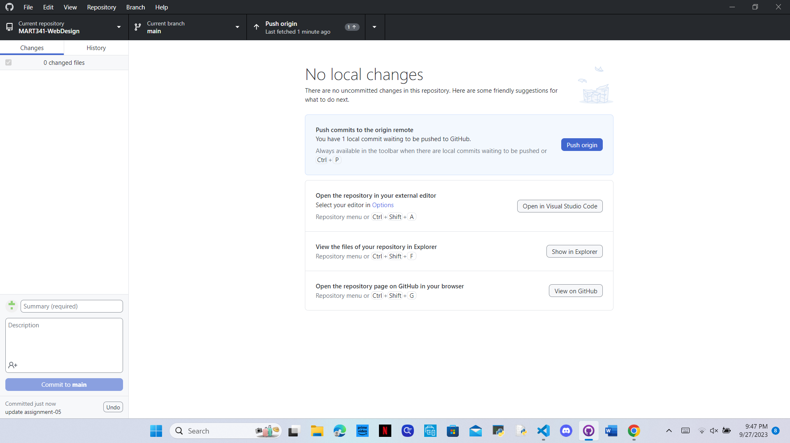

<h1>This is my assignment 5</h1>

<a href="https://blheisey.github.io/MART341-WebDesign/assignment-05/">https://blheisey.github.io/MART341-WebDesign/assignment-05/</a> This page has examples of new things I've learned in HTML. It includes examples of using different paragraphs, links, and line breaks. I used Github Desktop this week! Here's a screenshot of it:

